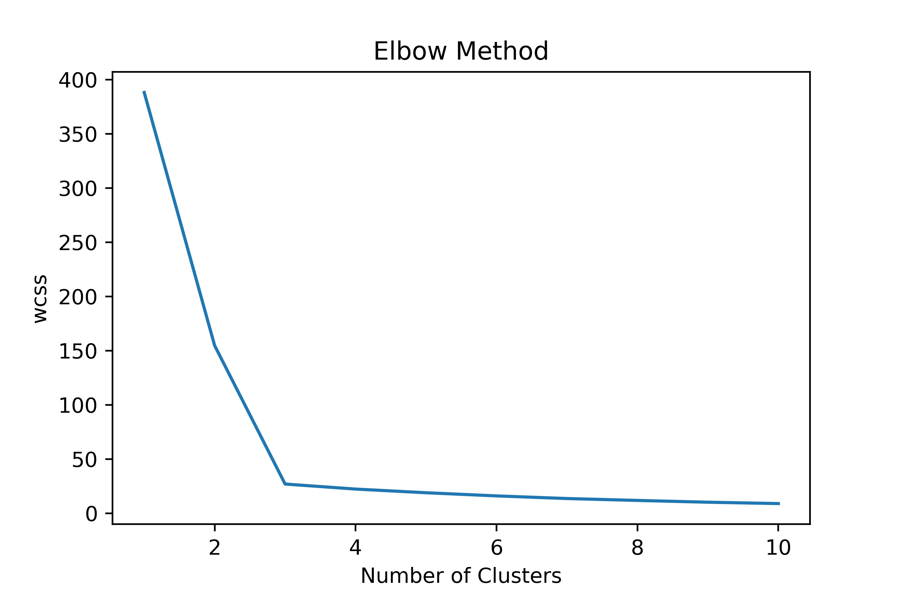
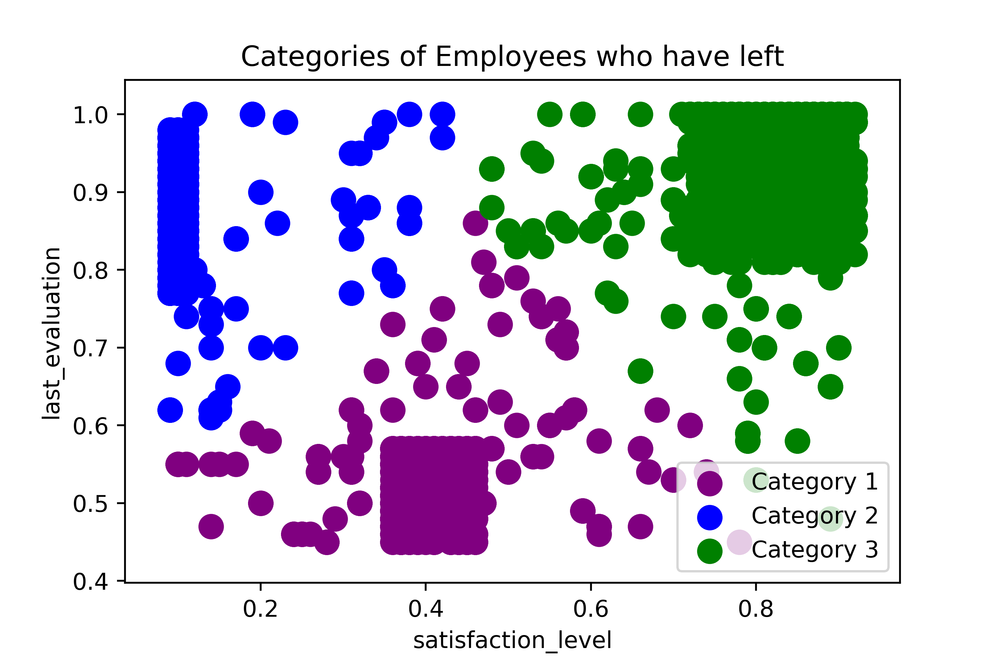
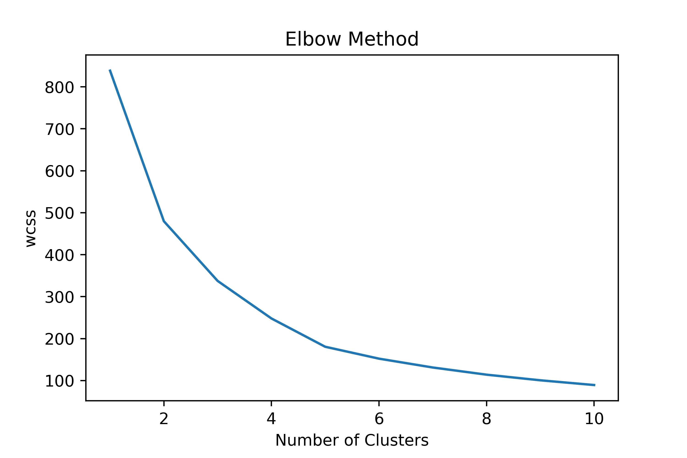
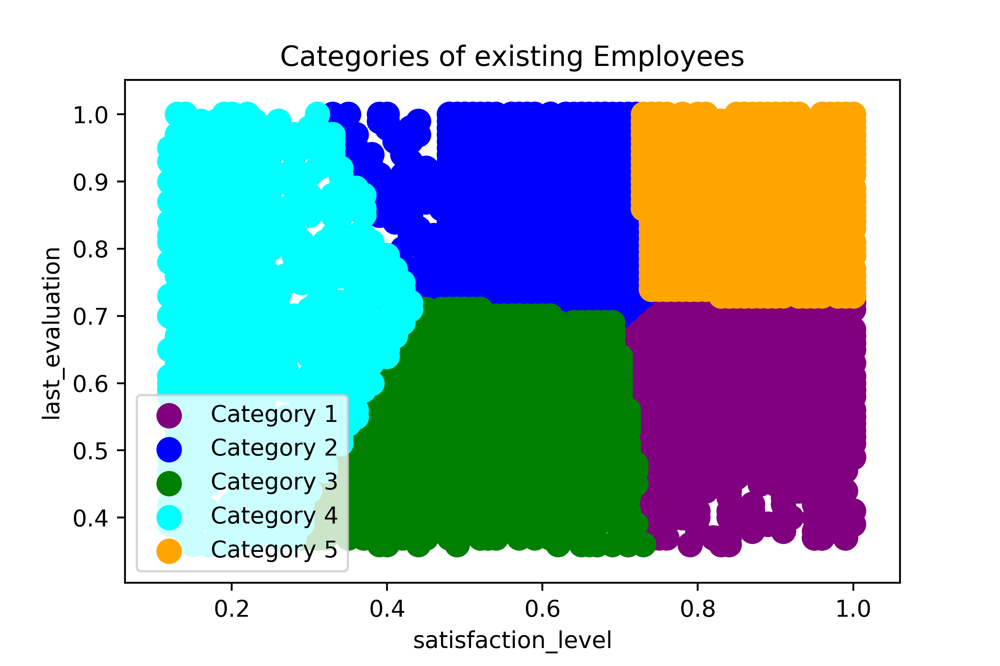

# PYTHON-MACHINE-LEARNING

## USING K-MEANS CLUSTER AND RANDOM FOREST CLASSIFIER TO SOLVE AND PREDICT COMPANY X'S EMPLOYEE ATTRITION PROBLEM

### Objectives

This project report aims to show the method I used to:

+ Determine the categories of employees leaving company X. 

+ Determine the categories of employees currently present in company X

+ Predict the employees that are prone to leaving company X next.

### Data Preprocessing
Importing necessary python libraries such as numpy, pandas, matplotlib.pyplot and seaborn

Importing the dataset

Preprocessing the dataset for analysis and visualisation by assigning 0 and 1 to represent existing and employees who had left, respectively.

### Data Exploration
To uncover patterns, characteristics, and relationships between existing employees and employees who have left the company

### Visualisation and Observation

The following observations were deduced from the visualisation:

+ The satisfaction level of the existing employees is higher than that of the employees who left.
+ The average monthly work hours of the existing employees are lower than those of the previous employees.
+ The employees who left were either under-engaged or over-engaged with project work.
+ The majority of the previous employees worked for the company for a period of 3-5 years, whereas most of the current employees have worked for 2-3 years.
+ Some of the current employees have experienced work-related accidents.
+ The current employees received more promotions within the last five years than the employees who left.
+ All the employees who left earned low or medium salaries. 
+ Most of the employees are in sales, technical, or support departments.

#### What type of employees were leaving?

Since this is a classification problem, I used K-Means Cluster Analysis to solve. Firstly, I imported the necessary class from the scikit-learn library. Then, I used the "Elbow Method" to determine the appropriate number of clusters before proceeding to visualize the clusters using matplotlib.

#### Deductions
Three categories of employees are leaving:
+ Category 1: Those with minimal satisfaction and low evaluation.
+ Category 2: Those with low satisfaction but high evaluation.
+ Category 3: Those with high satisfaction and evaluation. It can be said that this set of employees have reached their  career peak in the company and sought career  advancement  elsewhere.

#### What type of employees are present?
Using the same method, the below visualisations were generated.

#### Deductions
Five categories of employees are remaining:
+ Category 1: employees who are highly satisfied but have average evaluation.
+ Category 2: employees who are averagely satisfied but are evaluated highly.
+ Category 3: employees who have minimal satisfaction and minimal evaluation.
+ Category 4: employees with low satisfaction and high evaluation (present in the types of employees who left).
+ Category 5: employees who have both high satisfaction and high evaluation (present in the types of employees who left).

### Data Preprocessing and Fitting Machine Learning Model (Random Forest Classifier)
To predict the employees prone to leaving the company next, I performed the following:

+ Feature selection: Using the combined data, I selected the independent and the dependent variables.

+ Encoding categorical data: I encoded categorical columns using LabelEncoder from sklearn.preprocessing.

+ Splitting data into test and train set: I split the selected variables into 70% train and 30% test sets to make fitting the machine learning model possible and also make predictions.

+ Fitting Machine Learning Algorithm: I used the random forest classifier to predict the test results and checked the accuracy score using metrics from scikit-learn. This returned an accuracy result of 99.2%.

